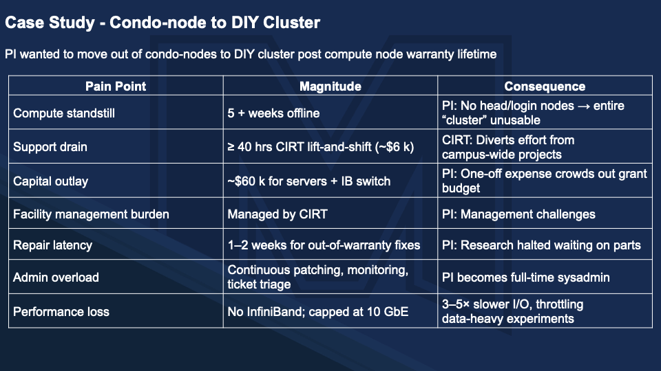

import Tag from '@site/src/components/Tag';
import Tabs from '@theme/Tabs';
import TabItem from '@theme/TabItem';

## Condo Model Description 
Condo computing is a shared ownership model where Principal Investigators (PIs), such as faculty members, use funds from grants or other sources to purchase and contribute compute resources, such as nodes, to a cluster. This creates a collective, researcher-owned computing resource of medium to large scale, offering access to configurations much larger than what each participant could individually afford.

Under the condo model, PIs use equipment purchase funds to buy compute nodes (CPU or GPU), which are then integrated into a shared cluster. Participating groups can either have dedicated use of their purchased nodes through private partitions or run larger computing jobs by utilizing idle nodes within the Pinnacles cluster. This setup provides immediate, integrated access to a larger cluster that would typically be beyond their individual means.

Participation in the program runs the duration of the node's warranty coverage (~ 3 years).

### Pinnacles is a Condo Model Cluster
To increase the longevity and computing resources available to the campus, Pinnacles has adopted a condo model structure. We welcome campus partners and PIs to consult with us and potentially collaborate to strengthen their computing resources and the Pinnacles cluster. 

:::note
When contributing to the Pinnacles cluster, PIs and their group members **will have highest priority for accessing their purchased computing resources**.

Queue Priority will be as follows: 

1. Users in the associated group(s) will receive the highest priority on the node through a private partition.
2. CIRT will allow all users to be placed on the condo node via the `test` partition.
:::

PIs can seek purchasing computing resources that are compatible with the Pinnacles Cluster. PIs can schedule a [consultation](https://ucmerced.service-now.com/servicehub?id=public_kb_article&sys_id=3c3ee9ff1b67a0543a003112cd4bcb13&form_id=06da3f8edbfc08103c4d56f3ce9619f4) with CIRT to discuss which computing resources(nodes) are compatible to be added to the Pinnacles cluster. 

The following tables summarize the CPU and GPU computing resources that are available for purchase in the Pinnacles condo program. 

## Hardware Compatibility and Costs for Pinnacles Cluster

<Tabs>
  
  <TabItem value="CPU" label="CPU Details" default>
    | CPU Model	| CPU Quantity Per Node| Core Count Per Node | RAM Capacity | 
    | -------- | ---- | ----------- |---------- |
    | Intel 28 core Xeon Gold 6330 | 2 |28 * 2 cores | 256GB | 
    | Intel 28 core Xeon Gold 6330 | 2 | 28 * 2 cores | 1TB |

    :::note
    RAM capacity can be scaled beyond 1TB, and similar configurations for CPU nodes are also supported.
    :::

  
  </TabItem>
  
  <TabItem value="GPU" label="GPU Details">
    | GPU Model	| GPU Card Quantity Per Node | RAM Capacity | 
    | -------- | ---- | ----------- |
    | Nvidia GPU | 1 - 4 cards | Varies |

    :::note
    The final price will be determined after the consultation.
    :::
  </TabItem>

   <TabItem value="Costs" label="Costs">
    Below is a table with associated tasks/items and their costs. 

    | Service | Unit | UC Rate |
    | --------------------- | ---------------- | -------------- |  
    | Annual operations fee | Annual| $401.00| 
    :::note 
    Costs from the table are estimates. **Final costs and configurations will be shared after consultation.** Annual fees covers labor to maintain the system, utilities, software licenses and other maintenance costs.
    :::
</TabItem>
</Tabs>

## Warranty 

PIs who contribute to Pinnacles by purchasing their own nodes will receive details about their nodes' warranty.

 An HPC cluster node will be considered  beyond its lifetime of maintainability when: 1. the compute node warranty from the HPC cluster vendor has expired, 2. the OS no longer supports the hardware, 3. security updates can no longer be installed on the hardware, or 4. hardware replacements become reasonably difficult to procure. Typically, computing resources come with a warranty of 3 years, though this duration may vary.

Below are options that CIRT offers to PIs when the nodes beyond its lifetime of maintainability . 

CIRT will give the PI two options: 

1. CIRT Keeps the node(s) and merge to public partition

    PI-owned queues will cease to exist and and the nodes will be merged into general, public partition(s).
    CIRT will take the ownership of the nodes and take responsibility for the maintenance and housing of the node post-warranty. CIRT will also reserve the right to retire the node(s).
   
2. CIRT returns the node to the PI

    CIRT will facilitate the removal of the PI node from the cluster. PIs may incur costs for CIRT's time and effort involved in this process. Once the node is returned, the PI will be solely responsible for it.

## Condo PI-Contributor Highlight 
The table below lists the PIs who have contributed nodes to the Pinnacles cluster, helping to enhance its growth and capabilities.

| PI | Department |  Queue | 
| -------------- | ----------------------- | --------------- |
| Bercem Dutagaci | QSB | pi.bdutagaci |
| Changho Kim | Applied Math | pi.ckim103 |
| Henrik Larsson | Chemistry & Biochemistry | pi.larsson |
| Ashlie Martini | Mechanical Engineering | pi.amartini |
| Anna Nierenberg | Physics | pi.anierenberg |
| Aurora Pribram-Jones | Chemistry & Biochemistry | pi.apribram-jones |
| David Strubbe | Physics | pi.dstrubbe |

## Condo Department-level Contributor Highlight
Here is a table of departments that have contributed nodes to the Pinnacles cluster, contributing to its growth and computing power.

| Department | Queue |
| ----------------- | --------------- |
| Life & Enviromental Science | dept.les |
| Applied Math | dept.appliedmath |
| Cognitive Science | dept.cogsci |
| Center for Cellular and Biomolecular Machines | grp.ccbm |
| Physics | dept.physics |

## Why should I choose the condo model over my own DIY server?

Below is a summary based on a case study for a PI who built a DIY cluster over condo model

## Joining the Condo Program 
Please reach out to CIRT to schedule a consultation via [ServiceNow](https://ucmerced.service-now.com/servicehub?id=public_kb_article&sys_id=3c3ee9ff1b67a0543a003112cd4bcb13&form_id=06da3f8edbfc08103c4d56f3ce9619f4)
