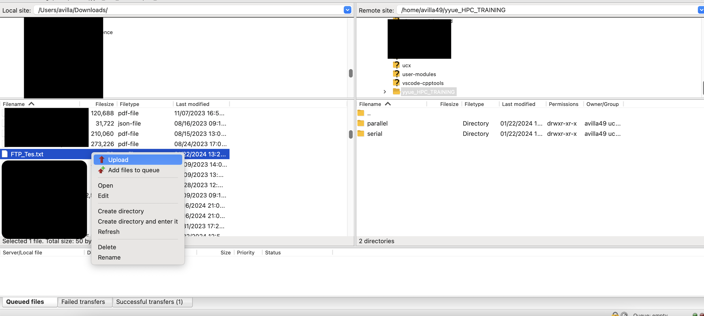

This page presents ways to transfer and share data with other users on the HPC clusters. Note that the word "group" on this page always refers to Unix groups.


## Data Transfer
There are many ways to transfer data between the cluster and local workspaces. Below are instructions and descriptions of two common methods of data transfer to and from the HPC cluster. 

Most casual and regular amounts of data transferring can be done through the `rc` login node, by pointing your transfer tool to `login.rc.ucmerced.edu` and can be done via one of the methods shown below. 

However, for transferring large amounts of data, FIONAs with dedicated bandwidths can be used for scheduled, unattended data transfers. If you are looking to complete a Big Data transfer, please submit a general research request [here](https://ucmerced.service-now.com/servicehub?id=public_kb_article&sys_id=3c3ee9ff1b67a0543a003112cd4bcb13&form_id=06da3f8edbfc08103c4d56f3ce9619f4).

### `scp` Command
The `scp` command is useful as it is an easy and versatile command that allows for two-way transfering of data. It does not require any setup to use and is great for constantly transferring different and separate files or directories. `scp` is a linear and basic copy and transfer of data; therefore, it does not have any failsafes to prevent data loss or data corruption. `scp` is generally used for simple files/directories and small, compressed files.

List of relevant options that can be used with SCP: 

| Option | Use |
|---------------|--------------------------|
| -C | Compress data before transfering | 
| -p	| Save the original file’s modification/access times, and modes |
| -r | Copy recursively; used to copy and transfer directories. |
| -v | Verbose, display the operation’s execution step by step |


Below are two examples using `scp`, one example of transferring data from remote machine to local machine, one example of transferring data from local to remote machine.

#### Local to Remote 
To transfer a file from the local machine, ensure that the command is being executed in the same directory as the file or folder or explicitly state the path in the command.
The following syntax can be used to transfer a file from a local machine to the remote machine: 

`scp [options] /path/to/file user@login.rc.ucmerced.edu:/remote/path`

#### Remote to Local
To transfer a file from the remote machine, ensure that the command is being executed on the **local machine** and the path of the file or folder is  stated in the command.
The following syntax can be used to transfer a file from the remote machine to a local machine: 
```bash
scp [options] user@login.rc.ucmerced.edu:/remote/file.txt /local/directory
```

#### Remote transfer files using `scp` command 
<div class="video-container">
  <iframe
    src="https://www.youtube.com/embed/G6DNWqHFC7A"
    title="YouTube video player"
    frameborder="0"
    allow="accelerometer; autoplay; clipboard-write; encrypted-media; gyroscope; picture-in-picture; web-share"
    allowfullscreen
  ></iframe>
</div>


### `rsync` Command 
The `rsync` command is similar to `scp` as it also copies files or directories locally or over a network. However, it employs a special transfer algorithm and a few optimizations tools to make the operation a lot faster. If the `rync` command is given the `-a` option it will copy the exact same access privileges, this is called mirroring. Usage of the `rsync` command is great when transferring larger files and directories. There are cases where the use of `rysnc` over `scp` can result in a quicker transfer times as `rsync`uses an algorithm to minimize the amount of data transferred by only transferring the portions of files that have been modified.

List of options that can be used with `rsync`:

| Option | Use |
|---------------|--------------------------|
| -a | Copy same access privileges |
| -v, --verbose	| Verbose, display the operation’s execution step by step| 
| -r |  Copy recursively; used to copy and transfer directories.|
| -u | skip updating files that are newer on the receiving end |
| -n | perform a trial run with no changes made |
| -W | copy and paste whole files, rather than only updating the changes of the file|
 

#### Using `rsync`
To Transfer files from local machine to remote machine the `rsync` command is: 
```bash
rsync [options] local/file/path user@login.rc.ucmerced.edu:/remote/path
```
To Transfer files from remote to local machine ensure the command is executed on the **local machine**. The `rsync` command is: 
```bash
rsync [options] user@login.rc.ucmerced.edd:/remote/path /local/path
```
**To copy folders or directories ensure `-r` option is implemented**
### Using FileZilla
<details>
<summary>Click here to view how to use Filezilla for data transferring</summary>

Filezilla is a computer application with a GUI interface that allows for easy transfer how lots of files and folders from the local machine to a remote machine(i.e. the Pinnacles and MERCED cluster)

#### Configuring and Using FileZilla 


1. Download FileZilla from the following site: [click here](https://filezilla-project.org/download.php )
2. Once downloaded, open the application and accept all necessary options for FileZilla to properly function. 

3. Fill in the according information in the respective boxes as noted by the numbers they are listed by

   1. In the `Host` box, enter: sftp://login.rc.ucmerced.edu
   2. In username, enter your username, that is the part of the remote cluster login before the **@** 
                
                Ex. If username is guest123@login.rc.ucmerced.edu, enter guest123
   3. Enter password to log into cluster
   4. This is the area where you will see your **local** files and folders, you can edit the scope by changing the directory in the `Local site:` box.
 4. Now you can click `Quickconnect` in the upper left side of the menu 

 Once you have the correct files selected on  the local or remote machine, simply drag and drop the files to the other side.
 
  Another way to transfer files/folders: right click on all the folders/files to add them to file queue or immediete transfer via the `Upload` button 

 

</details>

### Using VSCode to Transfer Data

<details>
<summary>Click here to learn how to use VSCode to transfer data</summary>

For users who use VSCode to edit and manipulate files, there is a helpful extension that can be downloaded from the VSCode store: ```Remote - SSH```. [Link](https://marketplace.visualstudio.com/items?itemName=ms-vscode-remote.remote-ssh) that can be accessed via web

####  Walkthrough on connecting to ```rc.login.ucmerced.edu``` via VSCode <!-- {docsify-ignore} -->

Once downloaded the extension mentioned above, you will see a new icon on the left sidebar of VSCode. 


 


1. Next, click on ```+``` to add a new SSH connection

2. A new prompt will come up to enter the the complete ssh login. An example of a proper ssh login for VSCode is ```ssh exampleUser@login.rc.ucmerced.edu```. Where ```exampleUser``` will be replaced by a proper username. 

 


3. Once the credential is typed in, there will be a prompt to where to store the host information, select the second option. 

4. Now there will be a prompt to enter a password, this is the password used to sign into the cluster. 

5. Finally, you will have access to open and manipulate any folder and file on the cluster via VSCode. There is also a built-in terminal which allows for submission of jobs and other manipulations to be done in the VSCode application. 
</details>
